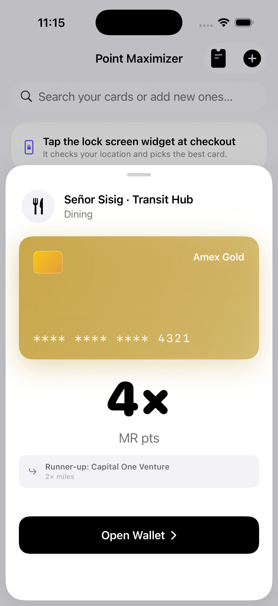
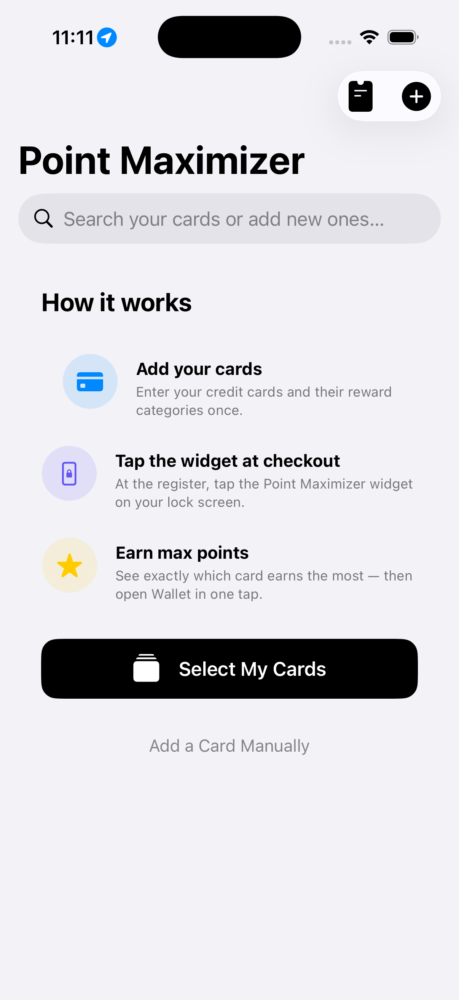
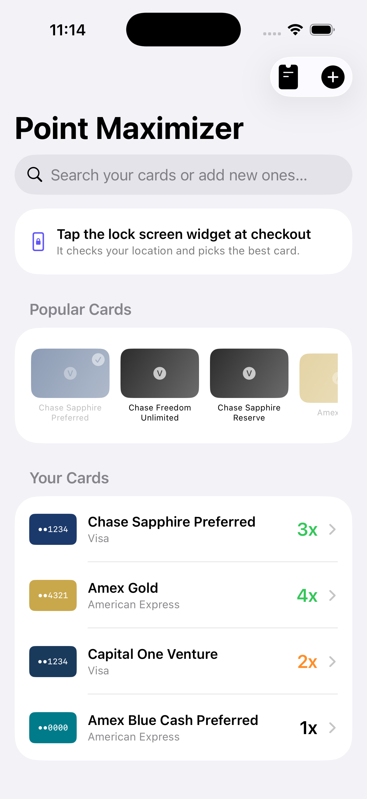
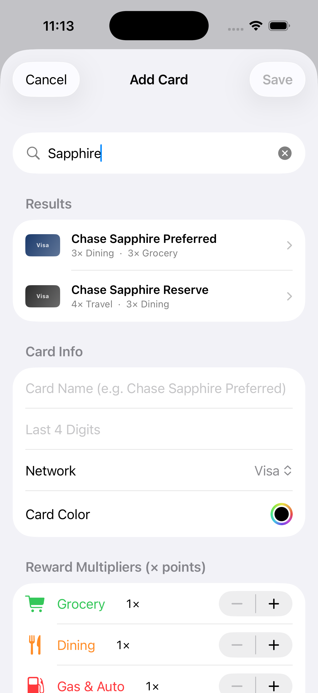
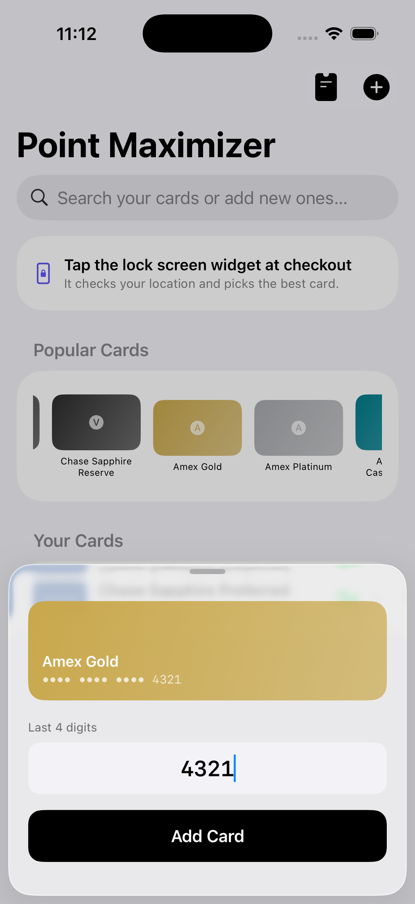
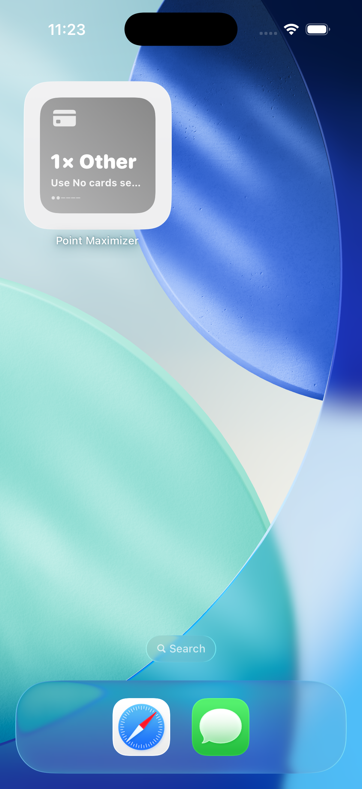

# Point Maximizer

**The smartest credit card at every checkout — right on your lock screen.**

Point Maximizer is a native iOS app that detects where you're shopping in real time and instantly tells you which credit card in your wallet earns the most points or cash back there. No more guessing at the register.

---

## Demo Video

<video src="https://github.com/user-attachments/assets/a1b3f032-cf50-43f9-8f25-2937735ce675" controls width="100%"></video>

---

## Screenshots

<!-- ── Hero ─────────────────────────────────────────────────────────── -->
<div align="center">
  
  <br/>
  <sub>The moment that matters — tap the widget, get the answer.</sub>
</div>

<br/>

<!-- ── Feature rows ──────────────────────────────────────────────────── -->
<table>
  <tr>
    <td width="45%" align="center">
      
    </td>
    <td width="55%" valign="middle" padding="20">
      <h3>Up and running in minutes</h3>
      <p>A clean 3-step onboarding explains exactly how the app works. One tap to import your cards — no manual data entry needed.</p>
    </td>
  </tr>
  <tr>
    <td width="55%" valign="middle" align="right">
      <h3>Your whole wallet, organized</h3>
      <p>Popular cards surface at the top for instant access. Your added cards sit below, each showing its best reward category in real time based on your location.</p>
    </td>
    <td width="45%" align="center">
      
    </td>
  </tr>
  <tr>
    <td width="45%" align="center">
      
    </td>
    <td width="55%" valign="middle">
      <h3>Find any card instantly</h3>
      <p>Search all 41 preset cards by name. Results show cards already in your wallet alongside presets you haven't added yet — tap the <code>+</code> to add either.</p>
    </td>
  </tr>
  <tr>
    <td width="55%" valign="middle" align="right">
      <h3>Add a card in seconds</h3>
      <p>Tap any card in the Popular strip or search results. A compact sheet slides up with a live card preview — just enter your last 4 digits and you're done.</p>
    </td>
    <td width="45%" align="center">
      
    </td>
  </tr>
</table>

<br/>

<!-- ── Widget showcase ───────────────────────────────────────────────── -->
<div align="center">
  <h3>Always one tap away</h3>
  <p>Available on the lock screen and home screen — wherever you need it at checkout.</p>
  <br/>
  
  &nbsp;&nbsp;&nbsp;
  
  <br/>
  <sub>Lock screen &nbsp;&nbsp;&nbsp;&nbsp;&nbsp;&nbsp;&nbsp;&nbsp;&nbsp;&nbsp;&nbsp;&nbsp;&nbsp;&nbsp;&nbsp;&nbsp;&nbsp;&nbsp;&nbsp;&nbsp;&nbsp;&nbsp;&nbsp;&nbsp;&nbsp;&nbsp;&nbsp;&nbsp; Home screen</sub>
</div>

---

## How It Works

1. **Add your cards** — Choose from 41 preset cards (Chase, Amex, Citi, Capital One, and more) or enter custom multipliers manually. Reward rates are verified against each issuing bank.
2. **Tap the lock screen widget at checkout** — A single tap triggers a one-shot location check. No app opening required.
3. **Use the best card** — A sheet slides up showing your top card, its multiplier, and a runner-up. Tap "Open Wallet" to pay.

---

## Features

### Location-Aware Recommendations
A custom Merchant Intelligence Engine cross-references your GPS coordinates with Apple's Maps database to classify merchants into reward categories (Grocery, Dining, Gas, Travel, Shopping) with a confidence score. Context tags like "Airport Terminal" or "Morning Commute" further refine the pick.

### Lock Screen Widget
Built with WidgetKit, the widget lives in the accessory circular slot below your clock — always one tap away. Also available as rectangular, inline, small, and medium home screen sizes.

### 41 Verified Card Presets
Every reward rate and quarterly spending cap is sourced directly from the issuing bank. Cards span:

| Issuer | Cards |
|--------|-------|
| Chase | Sapphire Preferred, Sapphire Reserve, Freedom Flex, Freedom Unlimited, Amazon Prime Visa, Freedom Rise, Marriott Bonvoy Boundless, United Explorer, Ink Business Cash, World of Hyatt |
| Amex | Gold, Platinum, Blue Cash Preferred, Blue Cash Everyday, Green, Cash Magnet, Delta SkyMiles Gold, Delta SkyMiles Platinum, Hilton Honors, Hilton Honors Surpass, Marriott Bonvoy Brilliant |
| Citi | Double Cash, Custom Cash, Strata Premier, Rewards+ |
| Capital One | Savor, Venture, VentureOne, Quicksilver |
| Discover | It Cash Back, It Miles, It Chrome |
| Bank of America | Customized Cash, Premium Rewards, Unlimited Cash, Travel Rewards |
| Wells Fargo | Active Cash, Autograph, Autograph Journey |
| US Bank | Altitude Go, Cash+, Shopper Cash Rewards |
| Bilt | Bilt Mastercard |
| Apple | Apple Card |

### Spending Cap Tracking
Quarterly spend caps (e.g. Amex Blue Cash Preferred's $1,500 grocery cap) are tracked per card per category. When you hit a cap mid-quarter, Point Maximizer automatically promotes the next best card for that category.

### Card Search
Search all 41 presets by name when adding a card. Reward rates, multipliers, and spending caps auto-fill instantly.

### Runner-Up Comparison
The recommendation sheet always shows your second-best option — so you know exactly what you're leaving on the table.

### Siri Shortcut
Ask "Which card should I use with Point Maximizer?" and get a spoken recommendation hands-free.

### Multi-Currency Point Valuation
Cards are ranked by real-world value — not just raw multiplier. Chase UR points at 2¢ each beat a raw 3× cash back card at 1¢ each. Point valuations sourced from The Points Guy (April 2026).

| Currency | Value |
|----------|-------|
| Chase Ultimate Rewards | 2.0¢ / pt |
| Amex Membership Rewards | 2.0¢ / pt |
| Bilt Points | 1.67¢ / pt |
| Citi ThankYou Points | 1.7¢ / pt |
| World of Hyatt Points | 1.7¢ / pt |
| Capital One Miles | 1.7¢ / pt |
| Wells Fargo Rewards | 1.5¢ / pt |
| US Bank Rewards | 1.5¢ / pt |
| United MileagePlus | 1.35¢ / pt |
| Delta SkyMiles | 1.2¢ / pt |
| Marriott Bonvoy Points | 0.7¢ / pt |
| Hilton Honors Points | 0.5¢ / pt |
| Cash Back | 1.0¢ / pt |

---

## Tech Stack

| Layer | Technology |
|-------|-----------|
| UI | SwiftUI |
| Widget | WidgetKit (accessory + home screen families) |
| Location | CoreLocation — significant-change monitoring + one-shot `requestLocation()` |
| Merchant detection | MapKit reverse geocoding + category classification |
| Data sharing | App Groups (UserDefaults suite) |
| Siri | AppIntents framework |
| Deep linking | Custom URL scheme `pointmaximizer://open` |
| Persistence | JSON-encoded UserDefaults via shared App Group |

---

## Project Structure

```
PointMaximizer/
├── Shared/
│   ├── Models.swift              # CreditCard, WidgetData, RewardCurrency, StoreCategory
│   ├── CardPresets.swift         # 41 verified card presets with caps
│   └── SharedDataManager.swift  # App Group persistence, spend tracking, card ranking
├── Managers/
│   ├── LocationManager.swift     # CLLocationManager + one-shot async location
│   ├── MerchantIntelligenceEngine.swift  # Location → merchant category
│   ├── NotificationManager.swift # Proactive checkout nudges
│   └── WalletManager.swift       # Pass deep-linking
├── Views/
│   ├── ContentView.swift         # Main list + onboarding + deep link handler
│   ├── CardRecommendationSheet.swift  # Spinner → result sheet
│   ├── WalletImportView.swift    # Visual card selector (41 presets)
│   ├── AddCardView.swift         # Manual add + search + quick start
│   ├── CardDetailView.swift      # Edit card + cap tracking
│   └── CardRow.swift             # List row with live category badge
├── LiveActivity/
│   └── LiveActivityManager.swift
└── RecommendCardIntent.swift     # Siri AppIntent

PointMaximizerWidget/
├── PointMaximizerWidget.swift    # Timeline provider + widget bundle
└── WidgetViews.swift             # Lock screen + home screen layouts
```

---

## Requirements

- iOS 17.0+
- Xcode 15+
- An App Group identifier configured in both the app and widget targets (`group.com.yourname.pointmaximizer`)

---

## Setup

1. Clone the repo and open `PointMaximizer.xcodeproj` in Xcode.
2. Set your development team in **Signing & Capabilities** for both the app and widget targets.
3. Update the App Group identifier in both targets to match your team.
4. Build and run on a device (location services require a real device for full functionality).
5. Add your lock screen widget: **Lock Screen → Long Press → Customize → add Point Maximizer**.
